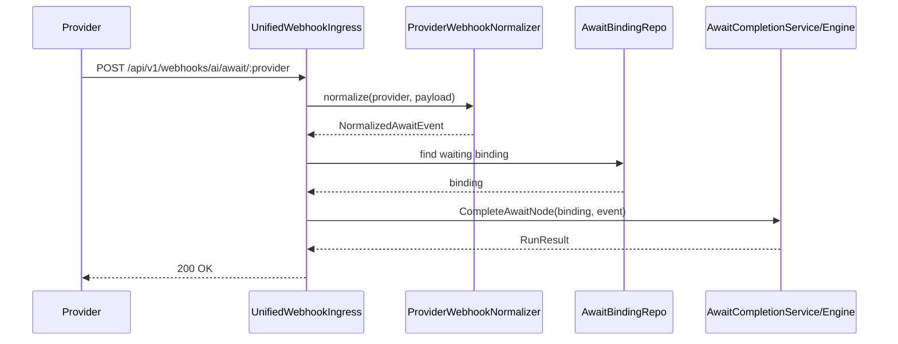
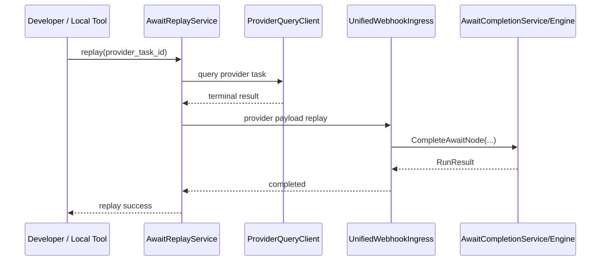

# Await Webhook Dev Replay Design

## 1. 背景

当前 `ai-engine` 已经具备：

1. `await` 节点
2. `AwaitBinding`
3. 统一 webhook ingress
4. `CompleteAwaitNode -> ResumeTask` 恢复链
5. fallback poll scanner

这使得生产环境中的“第三方 provider 回调 -> 唤醒 workflow”主路径已经成立。

但在本地开发和联调阶段，还存在一个现实问题：

1. 本地服务通常没有公网地址
2. 第三方 provider 无法直接回调本地 webhook
3. 如果只依赖内网穿透，联调成本高、稳定性差
4. 如果本地通过 poll 直接改 node/task 状态，又会绕开统一 webhook 模型，导致开发路径和生产路径分叉

因此，需要补充一套：

**统一 webhook 模型的开发态入口**

目标是在没有真实公网回调的情况下，仍然尽量复用生产环境的等待-唤醒主链路。

## 2. 设计目标

本方案目标是：

1. 保持生产环境继续使用统一 webhook ingress
2. 为本地开发/测试提供 replay / emulate 能力
3. 本地 replay 不新增另一套状态恢复逻辑
4. 尽可能复用现有 provider normalize、AwaitBinding 命中和 `CompleteAwaitNode`
5. 让本地联调路径尽量接近生产路径

## 3. 非目标

本方案不做：

1. 不替代生产 webhook 能力
2. 不让 replay 成为生产主路径
3. 不在 V1 中为所有 provider 一次性补全 replay
4. 不允许 replay 直接绕过 `AwaitBinding` 修改 task/node/binding 状态
5. 不要求 fallback poll 与 dev replay 合并为同一模块

## 4. 核心设计原则

### 4.1 开发态 replay 是统一 webhook 模型的事件来源模拟器

replay / emulate 的职责是：

1. 获取 provider 最终结果
2. 构造 provider webhook payload
3. 交给统一 webhook normalize / complete 链路

它不是另一套“本地直接恢复 task”的旁路机制。

### 4.2 生产链路与开发链路共用统一恢复入口

无论事件来源是：

1. 真实 webhook
2. dev replay
3. signal
4. fallback poll

最终都应尽量收敛到：

- `AwaitBinding`
- `CompleteAwaitNode`
- `ResumeTask`

### 4.3 replay 不能直接写运行时状态

禁止 replay：

1. 直接把 node 标为 `success`
2. 直接把 task 标为 `running/success`
3. 直接跳过 provider normalize
4. 直接绕开 `AwaitBinding`

否则会导致开发路径与生产路径分叉。

### 4.4 fallback poll 与 dev replay 职责分离

两者都可能调用 provider 查询接口，但目标不同：

1. `fallback poll`
   - 生产兜底
   - 目标是 webhook 丢失时恢复任务

2. `dev replay`
   - 开发联调
   - 目标是本地没有公网时验证 webhook 主路径

## 5. 总体方案

本方案由 3 层组成：

1. 统一 webhook ingress
2. 内部 replay / emulate service
3. 可选的开发态 HTTP 调试入口

整体上：

- 生产 provider 调统一 webhook ingress
- 本地开发调用 replay service
- replay service 通过 poll 获取终态后，构造 provider payload，再交给统一 webhook 模型处理

## 6. 统一 Webhook Ingress

统一入口按 provider 路径收敛，阿里云 EventBridge 保留专用入口：

- `POST /api/v1/webhooks/ai/await/:provider`
- `POST /api/v1/webhooks/ai/await/aliyun/eventbridge`（阿里云 EventBridge 专用入口）

职责：

1. HTTP 请求解析
2. provider 验签
3. provider payload normalize
4. 根据外部 key 命中 `AwaitBinding`
5. 调用统一完成入口
6. 返回标准响应

### 6.1 建议分层

建议将统一 webhook ingress 分为三层：

1. `AwaitWebhookHandler`
   - HTTP 层
   - 负责 request / response

2. `ProviderWebhookNormalizer`
   - 负责 provider payload -> 统一事件模型

3. `AwaitCompletionService`
   - 负责 binding 命中、幂等、完成节点、恢复任务

### 6.2 建议统一事件模型

```go
type NormalizedAwaitEvent struct {
	Provider       string
	Source         string // webhook | replay | signal | poll
	IsTerminal     bool
	IsSuccess      bool
	ProviderTaskID string
	APITaskID      string
	EventPayload   map[string]any
	ErrorMessage   string
	RawPayload     map[string]any
}
```

作用：

1. 真实 webhook 与 replay 可共用同一 normalize/complete 逻辑
2. `source` 可进入 event / inspector 方便排障
3. 不同 provider 的事件最终都映射到统一等待模型

## 7. 内部 Replay / Emulate Service

### 7.1 定位

`AwaitReplayService` 是开发态/测试态能力，不是生产 provider 入口。

职责：

1. 在本地没有公网回调时提供联调路径
2. 在测试环境中提供事件回放能力
3. 通过 poll 获取 provider 当前结果
4. 将 provider 当前结果转换成 webhook 事件语义

### 7.2 接口建议

```go
type AwaitReplayService interface {
	ReplayProviderTask(ctx context.Context, req ReplayProviderTaskReq) (*ReplayProviderTaskResp, error)
}
```

```go
type ReplayProviderTaskReq struct {
	Provider       string
	ProviderTaskID string
	APITaskID      string
	BindingID      int64
	TaskID         int64
	NodeName       string
	Mode           string // poll_and_replay | payload_replay
	RawPayload     map[string]any
}
```

```go
type ReplayProviderTaskResp struct {
	Matched      bool
	IsTerminal   bool
	Status       string
	Provider     string
	ProviderTask string
	Source       string
	Message      string
}
```

### 7.3 两种模式

#### `poll_and_replay`

流程：

1. 根据 `provider_task_id` / `api_task_id` 查询 provider 当前任务状态
2. 若未到终态，则返回 “ignored_non_terminal”
3. 若已到终态，则构造 provider webhook payload
4. 将 payload 交给统一 webhook normalize / complete 链路

适用：

1. 本地联调
2. 没有公网 webhook 时的真实 provider 联调

#### `payload_replay`

流程：

1. 调用方直接提供 provider webhook payload
2. replay service 复用统一 normalize 逻辑
3. 命中 `AwaitBinding`
4. 完成 `await` 节点并恢复任务

适用：

1. 集成测试
2. 手工回放历史 callback payload
3. 排查线上异常 payload

## 8. 开发态 HTTP 调试入口

建议只在开发或测试环境开放：

- `POST /internal/await/providers/:provider/replay`

### 8.1 请求体建议

`poll_and_replay`：

```json
{
  "mode": "poll_and_replay",
  "provider_task_id": "xxx",
  "api_task_id": "xxx"
}
```

`payload_replay`：

```json
{
  "mode": "payload_replay",
  "payload": {
    "task_id": "xxx",
    "status": "succeeded"
  }
}
```

### 8.2 访问限制建议

该接口不应对公网开放。

建议限制：

1. 仅 dev/test 环境注册
2. 仅内网或 localhost 可访问
3. 生产环境配置显式关闭

## 9. 开发态开关

建议配置项如下：

```yaml
ai_engine:
  await:
    dev_replay_enabled: true
    dev_replay_http_enabled: true
    dev_replay_allow_providers:
      - kling
      - volcengine
    dev_replay_require_localhost: true
```

### 9.1 配置语义

`dev_replay_enabled`

- 是否启用 replay service 能力

`dev_replay_http_enabled`

- 是否注册 HTTP replay route

`dev_replay_allow_providers`

- 限制可 replay 的 provider 白名单

`dev_replay_require_localhost`

- 是否仅允许本机或开发网络访问

### 9.2 环境建议

生产建议：

1. `dev_replay_enabled=false`
2. `dev_replay_http_enabled=false`

本地开发建议：

1. `dev_replay_enabled=true`
2. `dev_replay_http_enabled=true`

测试环境建议：

1. 可按需开启
2. 仅用于内部联调，不作为外部对外能力

## 10. 调用时序

### 10.1 生产主路径



### 10.2 本地开发 replay 路径



关键点：

1. replay 不直接恢复任务
2. replay 只是把事件送进统一 webhook 模型

## 11. 与 Fallback Poll 的边界

### 11.1 fallback poll

用途：

1. 生产环境兜底
2. webhook 丢失时恢复等待任务

典型行为：

1. scanner 扫描 `next_poll_at <= now`
2. 调 poll tool
3. 若命中终态，直接走统一 completion

### 11.2 dev replay

用途：

1. 本地开发和联调
2. 在没有公网 webhook 的情况下验证 webhook 主路径

典型行为：

1. 手工或脚本触发 replay
2. poll 获取 provider 当前状态
3. 构造 provider payload
4. replay 给统一 webhook ingress

### 11.3 为什么不合并

两者虽然都可能查询 provider，但职责不同：

1. fallback poll 是生产恢复机制
2. dev replay 是开发联调机制

如果合并：

1. 会让生产模块承担开发态语义
2. 会让开发联调逻辑侵入正式恢复路径
3. 会弱化统一 webhook ingress 的价值

## 12. 测试分层策略

建议测试分为 4 层。

### 12.1 单元测试

目标：

1. 测 provider normalizer
2. 测 replay service 的非终态/终态判断

覆盖点：

1. terminal success
2. terminal failed
3. non-terminal ignored
4. invalid payload

### 12.2 handler 集成测试

目标：

1. 测统一 webhook ingress
2. 测 `AwaitBinding -> CompleteAwaitNode -> ResumeTask`

覆盖点：

1. webhook 命中 binding
2. duplicate webhook 幂等
3. stale binding 拒绝

### 12.3 replay service 集成测试

目标：

1. 验证 `poll_and_replay`
2. 验证 `payload_replay`

覆盖点：

1. provider 查询终态成功 -> replay 完成
2. provider 查询未终态 -> ignore
3. binding 不存在
4. replay 被配置禁用

### 12.4 本地联调测试

目标：

1. 在本地无公网地址情况下验证 await webhook 主路径

建议步骤：

1. 启动本地 server
2. 提交 workflow task，使节点进入 `awaiting`
3. 触发 `/internal/await/providers/:provider/replay`
4. 观察：
   - `AwaitBinding`
   - task event
   - inspector
   - task/node 状态

## 13. 事件与可观测性建议

为了便于排障，建议为 replay 加入结构化事件：

1. `await_replay_requested`
2. `await_replay_completed`
3. `await_replay_ignored_non_terminal`
4. `await_replay_binding_not_found`

建议 meta 至少包含：

1. `provider`
2. `source=replay`
3. `binding_id`
4. `provider_task_id`
5. `api_task_id`
6. `task_id`
7. `node_name`
8. `mode`
9. `reason`

Inspector 建议展示：

1. `last_event_source`
2. `source=replay`
3. replay 相关事件 timeline

## 14. 安全约束

开发态 replay 需要额外注意安全边界：

1. 不对公网开放
2. 仅在 dev/test 环境开启
3. 仅允许白名单 provider
4. 建议加额外 debug token 或本机访问限制
5. replay 不允许直接修改 runtime 状态

## 15. 推荐最小落地范围

建议按最小可行范围落地：

1. 启用统一 provider 入口 `POST /api/v1/webhooks/ai/await/:provider`
2. 新增内部 `AwaitReplayService`
3. 新增可选 dev route：
   - `POST /internal/await/providers/:provider/replay`
4. 第一阶段仅支持：
   - `kling`
   - `volcengine`
5. 第一阶段优先支持：
   - `poll_and_replay`
6. 所有 replay 请求都在事件与 inspector 中标记 `source=replay`

## 16. 结论

该方案与当前 `await` 设计不冲突，且能增强统一性。

更准确地说：

1. 生产环境走真实 webhook
2. 本地开发走 replay webhook
3. 集成测试可直接走 handler 或 replay service
4. 最终都尽量收敛到：
   - `AwaitBinding`
   - `CompleteAwaitNode`
   - `ResumeTask`

这使得：

1. 开发路径更接近生产路径
2. 本地没有公网回调时仍可联调
3. webhook 不会退化成“生产才有、开发不用”的弱约束能力
