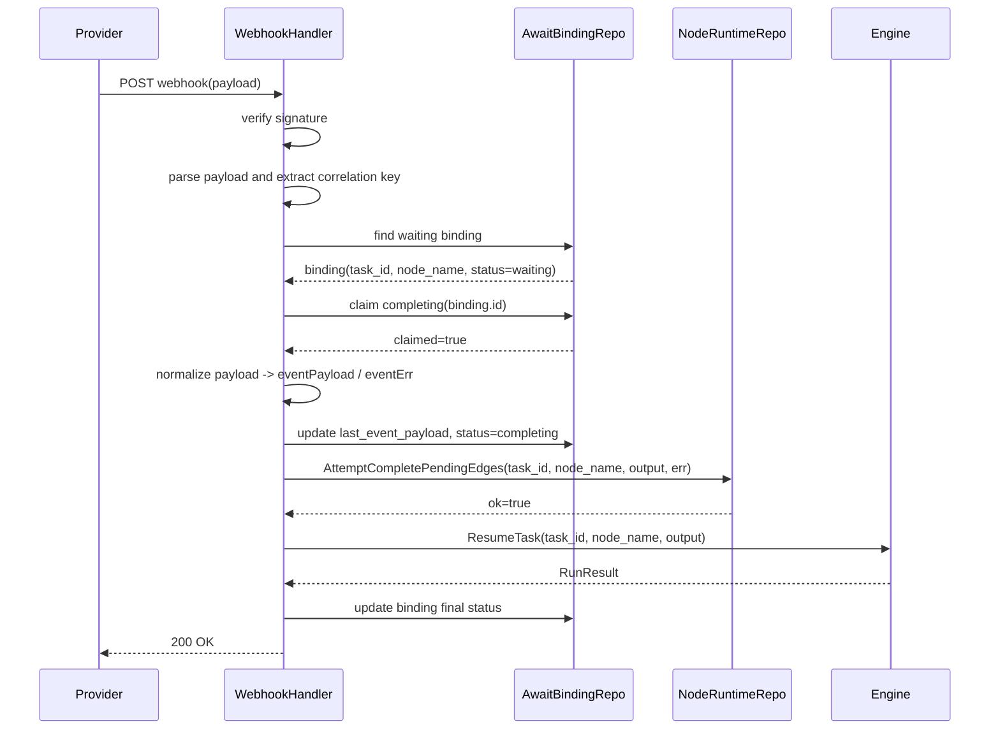

# AI Engine Await/Receive Runtime V1 产品需求文档（PRD）

日期：2026-04-23

状态：Draft

负责人：AI Engine / Workflow Engine

关联文档：

- [AI Engine 第二阶段产品需求文档](/Users/xiaoyuan/Documents/work/git/dream-ai-webhook-workflow/ai-engine/docs/engine-phase2-prd.md)
- [AI Engine 第二阶段迭代需求文档](/Users/xiaoyuan/Documents/work/git/dream-ai-webhook-workflow/ai-engine/docs/engine-phase2-requirements.md)
- [AI Engine Workflow Engine Test Checklist](/Users/xiaoyuan/Documents/work/git/dream-ai-webhook-workflow/ai-engine/docs/engine-test-checklist.md)

## 1. 项目背景

当前 `ai-engine` 已具备工作流 DAG 执行、异步节点挂起恢复、子工作流恢复、`map / loop / subworkflow` 等核心运行时能力。

但现有异步模型主要围绕 `tool.AsyncExecution` 展开，其核心语义是：

- 引擎调度一个异步 worker
- worker 完成后发布事件
- 引擎监听事件并恢复任务

这套模型适合“引擎内部可控的异步执行”，但不适合以下越来越常见的场景：

- 调用厂商接口创建任务后，等待厂商 webhook 回调
- webhook 丢失后，通过低频 poll 做补偿确认
- 流程执行到某节点后，需要等待用户选择再继续
- 等待审批、消息回执、业务系统回调等外部输入

这些场景的共同点不是“执行一个异步 tool”，而是“流程到达一个等待点，挂起并等待外部世界唤醒”。

因此，本期需求不是继续扩展若干 `wait tool`，而是把“等待-唤醒”抽象提升为引擎一等能力，形成统一的 `await / receive` 运行时模型。

## 2. 目标

本期目标：

1. 引入新的 `await` 节点类型，显式表达“等待外部事件/输入”的流程语义
2. 为工作流运行时补充统一的等待订阅模型，而不是将 webhook/poll/user input 混入普通节点输出
3. 建立 `AwaitBinding` 作为外部事件进入引擎的第一落点
4. 建立从 `webhook / signal / poll` 到 `ResumeTask` 的统一恢复链路
5. 让“厂商回调”和“用户选择”共享同一套等待-唤醒抽象

## 3. 非目标

本期非目标：

1. 不在 V1 中一次性支持所有 provider 的 webhook 接入
2. 不在 V1 中完成完整的用户选择前端交互页面
3. 不在 V1 中重构现有全部 `tool.AsyncExecution`
4. 不优先做复杂的审批中心、消息总线产品能力
5. 不把业务分支判断塞进 `await` 节点内部，边条件仍沿用现有 edge condition 模型

## 4. 核心设计原则

### 4.1 DSL 只表达等待语义，不表达 provider 细节

`await` 节点用于表达：

- 等待什么类型的外部输入
- 用什么相关性键绑定
- 收到结果后如何映射输出
- 是否启用 fallback poll

但不鼓励把 provider 特有 webhook 字段、验签协议、HTTP 细节散落在业务 DSL 中。

### 4.2 外部事件先命中 AwaitBinding，再进入 workflow runtime

所有外部唤醒事件，包括：

- provider webhook
- 用户选择
- 审批结果
- fallback poll 命中结果

都必须先路由到 `AwaitBinding`，再定位到 `task_id + node_name`，最后进入 `ResumeTask`。

### 4.3 分支决策继续留在 Edge 上

`await` 节点只负责等待与产出结果。

收到结果后走哪条边，仍由现有 `EdgeCondition` 决定，例如：

- `await_user_choice.choice == 'A'`
- `provider_result.status == 'succeeded'`

### 4.4 webhook 是主路径，poll 是兜底

V1 必须把 webhook 视作主完成路径，把 poll 视作补偿手段，而不是继续让 wait 节点高频轮询厂商接口。

### 4.5 所有状态更新必须走状态机

Await Runtime V1 引入后，状态更新入口会显著增加，包括：

- await 节点初次挂起
- webhook 命中完成
- signal 命中完成
- fallback poll 命中完成
- timeout 扫描
- cancel / retry / recovery

如果这些入口直接修改 `task / node / binding` 状态字段，极易与现有节点流转模型冲突，导致：

- `node awaiting` 与 `task running` 不一致
- 已完成的 binding 被重复改回 waiting
- webhook / poll / signal 之间出现并发覆盖
- `ResumeTask` 恢复前后状态不符合既有约束

因此，V1 强制要求：

1. `Task` 状态更新必须通过统一任务状态机入口完成
2. `NodeRuntime` 状态更新必须通过统一节点状态机入口完成
3. `AwaitBinding` 状态更新必须通过显式 binding 状态机入口完成
4. 禁止在 webhook handler、signal handler、poll scanner 中直接赋值状态字段
5. 对非法状态迁移必须拒绝执行并记录结构化错误

这不是实现细节，而是 Await Runtime V1 的硬性约束。

## 5. DSL 设计

### 5.1 新增节点类型

在 `definition.NodeType` 中新增：

```go
NodeAwait = "await"
```

该节点表示：流程运行到此处时，创建等待订阅并挂起任务，直到收到外部输入后再继续执行。

### 5.2 基本 DSL 结构

建议 DSL 结构如下：

```json
{
  "name": "provider_result",
  "type": "await",
  "weight": 0.4,
  "config": {
    "await_type": "external_task",
    "source": "webhook_or_poll",
    "provider": "kling",
    "correlation": {
      "provider_task_id": "submit.api_task_id",
      "api_task_id": "submit.api_task_id"
    },
    "completion": {
      "success_expr": "event.status in ['success', 'succeeded']",
      "failure_expr": "event.status in ['failed', 'error']",
      "output_mapping": {
        "video_url": "event.video_url",
        "api_task_id": "event.api_task_id",
        "provider_task_id": "event.provider_task_id",
        "status": "event.status"
      },
      "error_mapping": "event.error_message"
    },
    "fallback_poll": {
      "enabled": true,
      "tool": "kling_motion_poll",
      "start_after_seconds": 60,
      "interval_seconds": 600,
      "max_attempts": 10
    },
    "timeout_seconds": 86400
  }
}
```

### 5.3 用户选择场景 DSL 示例

```json
{
  "name": "user_choice",
  "type": "await",
  "config": {
    "await_type": "user_input",
    "source": "signal",
    "signal_name": "publish_strategy_selected",
    "callback_token_expr": "input.request_id",
    "completion": {
      "success_expr": "event.choice != ''",
      "output_mapping": {
        "choice": "event.choice",
        "comment": "event.comment",
        "operator_id": "event.operator_id"
      }
    },
    "timeout_seconds": 259200
  }
}
```

### 5.4 Edge 使用方式

不新增 branch 语法，继续复用现有 edge condition：

```json
{
  "from": "user_choice",
  "to": "path_a",
  "type": "condition",
  "condition": "user_choice.choice == 'A'"
}
```

### 5.5 V1 支持的 await_type

V1 建议先定义枚举，但只要求实现其中前两种：

- `external_task`
- `user_input`
- `message`
- `approval`

V1 必须可用的 source：

- `webhook`
- `signal`
- `poll`
- `webhook_or_poll`

## 6. 数据模型

### 6.1 新增 AwaitBinding 表

新增表：`await_bindings`

职责：

- 作为等待点的订阅记录
- 作为外部事件到内部任务节点的路由表
- 作为等待生命周期与 fallback poll 的调度状态表

### 6.2 表结构

建议模型如下：

```go
type AwaitBindingModel struct {
	ID int64 `gorm:"primaryKey"`

	TaskID            int64  `gorm:"not null;index"`
	RootTaskID        int64  `gorm:"not null;index"`
	NodeName          string `gorm:"type:varchar(100);not null;index"`
	WorkflowVersionID int64  `gorm:"not null;index"`

	AwaitType string `gorm:"type:varchar(50);not null;index"`
	Source    string `gorm:"type:varchar(50);not null"`
	Status    string `gorm:"type:varchar(30);not null;index"`

	Provider       *string `gorm:"type:varchar(50);index"`
	ProviderTaskID *string `gorm:"type:varchar(255);index"`
	APITaskID      *string `gorm:"type:varchar(255);index"`
	ExternalTaskID *string `gorm:"type:varchar(255);index"`

	SignalName    *string `gorm:"type:varchar(100);index"`
	MessageName   *string `gorm:"type:varchar(100);index"`
	CallbackToken *string `gorm:"type:varchar(255);index"`

	CorrelationJSON datatypes.JSON `gorm:"type:jsonb"`
	ConfigJSON      datatypes.JSON `gorm:"type:jsonb"`

	LastEventID      *string        `gorm:"type:varchar(255);index"`
	LastEventSource  *string        `gorm:"type:varchar(50)"`
	LastEventPayload datatypes.JSON `gorm:"type:jsonb"`

	ResultPayload datatypes.JSON `gorm:"type:jsonb"`
	ErrorMessage  *string        `gorm:"type:text"`

	FallbackPollEnabled bool       `gorm:"not null;default:false"`
	FallbackPollTool    *string    `gorm:"type:varchar(100)"`
	PollAttempts        int        `gorm:"not null;default:0"`
	MaxPollAttempts     int        `gorm:"not null;default:0"`
	LastPolledAt        *time.Time `gorm:"index"`
	NextPollAt          *time.Time `gorm:"index"`

	WaitingStartedAt *time.Time `gorm:"index"`
	TimeoutAt        *time.Time `gorm:"index"`
	CompletedAt      *time.Time `gorm:"index"`
	FailedAt         *time.Time `gorm:"index"`
	CanceledAt       *time.Time `gorm:"index"`

	CreatedAt time.Time
	UpdatedAt time.Time
}
```

### 6.3 为什么 V1 就引入单独表

虽然理论上可以把部分等待信息暂时塞进 `task_nodes.checkpoint_json`，但 V1 直接引入 `AwaitBinding` 更符合长期模型，主要原因：

1. webhook 到来时，天然是按外部 key 反查等待点，而不是按 `task_id` 反查节点
2. `task_nodes` 的职责是节点运行时状态，不应该承担等待订阅、事件路由、poll 调度三种职责
3. fallback poll 需要独立扫描等待中的订阅记录
4. 用户输入、webhook、消息回执最终会共享同一套等待模型

## 7. 索引设计

### 7.1 核心路由索引

必须有：

- `(provider, provider_task_id, status)`
- `(provider, api_task_id, status)`
- `(await_type, signal_name, callback_token, status)`

用途：

- webhook 到来时按 provider task id 路由
- signal 到来时按 signal name 和 token 路由

### 7.2 task 维度索引

必须有：

- `(task_id, node_name)`
- `(root_task_id, status)`

用途：

- task 内按节点恢复等待点
- 查询 root task 下的等待节点

### 7.3 调度索引

必须有：

- `(status, next_poll_at)`
- `(status, timeout_at)`

用途：

- 扫描到期的 fallback poll
- 扫描超时未完成的等待点

### 7.4 唯一性约束

建议逻辑约束：

1. 同一个 `task_id + node_name` 在活跃状态下只能存在一个 binding
2. 同一个 `provider + provider_task_id` 在活跃状态下只能命中一个 waiting binding

若数据库支持部分索引，可在后续版本中增强为条件唯一索引。

## 8. 状态机

### 8.1 节点状态机

在 `domain.NodeState` 中新增：

```go
NodeAwaiting NodeState = "awaiting"
```

推荐状态迁移：

- `pending -> ready`
- `ready -> running`
- `running -> awaiting`
- `awaiting -> success_pending_edges`
- `awaiting -> failed_pending_edges`
- `awaiting -> canceled`

要求：

- 上述状态迁移必须纳入统一节点状态机，不允许在 await 专用逻辑中旁路更新
- 现有 `success_pending_edges / failed_pending_edges` 语义继续保留，不新增并行的 await 完成终态

语义说明：

- `running -> awaiting`：节点已完成等待订阅创建，任务进入挂起
- `awaiting -> success_pending_edges`：收到成功事件，等待边计算
- `awaiting -> failed_pending_edges`：收到失败事件，等待边关闭或失败收敛

### 8.2 Task 状态机

任务状态沿用当前：

- `pending`
- `running`
- `suspended`
- `success`
- `failed`
- `canceled`

当 await 节点进入 `awaiting` 后：

- 节点状态：`awaiting`
- 任务状态：`suspended`

要求：

- `running -> suspended`
- `suspended -> running`

必须通过统一 task 状态迁移入口完成，而不是在各个 handler / scanner 中直接赋值。

### 8.3 AwaitBinding 状态机

建议状态：

- `pending`
- `waiting`
- `completing`
- `completed`
- `failed`
- `timed_out`
- `canceled`

推荐迁移：

- `pending -> waiting`
- `waiting -> completing`
- `completing -> completed`
- `completing -> failed`
- `waiting -> timed_out`
- `waiting -> canceled`

`completing` 的意义：

- webhook 重复投递时提供第一层幂等闸门
- webhook 和 poll 同时命中时，只有一个执行完成链

要求：

- `AwaitBinding` 的所有状态迁移必须通过显式 transition / claim 接口完成
- repository 不应暴露无约束的任意状态覆盖写法给业务入口直接使用

## 9. 接口设计

### 9.1 AwaitBinding Repository

建议新增仓储接口：

```go
type AwaitBindingRepository interface {
	Create(ctx context.Context, b *domain.AwaitBinding) error
	Update(ctx context.Context, b *domain.AwaitBinding) error

	GetByTaskAndNode(ctx context.Context, taskID int64, nodeName string) (*domain.AwaitBinding, error)

	FindWaitingByProviderTaskID(ctx context.Context, provider, providerTaskID string) (*domain.AwaitBinding, error)
	FindWaitingByAPITaskID(ctx context.Context, provider, apiTaskID string) (*domain.AwaitBinding, error)
	FindWaitingBySignal(ctx context.Context, signalName, callbackToken string) (*domain.AwaitBinding, error)

	ClaimCompleting(ctx context.Context, id int64, expectedStatuses []string) (bool, error)

	FindPollDue(ctx context.Context, now time.Time, limit int) ([]*domain.AwaitBinding, error)
	FindTimeoutDue(ctx context.Context, now time.Time, limit int) ([]*domain.AwaitBinding, error)
}
```

除 `ClaimCompleting` 外，V1 还应提供显式状态迁移方法，避免上层直接拼装 `status=...` 的 update 语句。

### 9.2 Await 节点执行接口

`await` 节点在执行时不阻塞等待，而是：

1. 解析 config 和 correlation
2. 创建 `AwaitBinding`
3. 将 node runtime 置为 `awaiting`
4. 返回 `WorkflowSuspendedError`

### 9.3 外部完成统一入口

建议新增引擎侧统一入口：

```go
CompleteAwaitNode(
    bindingID int64,
    eventPayload map[string]any,
    eventErr string,
    source string,
) RunResult
```

或者按 task/node 粒度：

```go
CompleteAwaitNodeByTaskNode(
    taskID int64,
    nodeName string,
    eventPayload map[string]any,
    eventErr string,
    source string,
) RunResult
```

V1 更推荐按 `bindingID` 进入，因为外部事件首先命中的是 `AwaitBinding`。

### 9.4 Webhook Handler

推荐统一入口模式：

- `POST /api/v1/webhooks/ai/await/:provider`

也允许后续 provider 独立 handler：

- `POST /api/v1/webhooks/ai/await/kling`
- `POST /api/v1/webhooks/ai/await/volcengine`
- `POST /api/v1/webhooks/ai/await/aliyun/eventbridge`（阿里云 EventBridge 专用入口）

handler 职责：

1. 验签
2. 解析 provider payload
3. 提取 correlation key
4. 查 `AwaitBinding`
5. 抢占 `completing`
6. 归一化 payload 为 `eventPayload`
7. 调用 `CompleteAwaitNode`

### 9.5 Signal Handler

V1 建议同时预留 signal 入口：

- `POST /ai-engine/tasks/:task_id/await/:node_name/signal`

或：

- `POST /ai-engine/await/signal`

请求体至少包含：

- `signal_name`
- `callback_token`
- `payload`

### 9.6 Dev Replay / Local Webhook Simulation

为了避免本地开发强依赖公网 webhook，建议在主文档体系中预留一类开发态增强能力：

1. 生产环境继续使用统一 webhook ingress
2. 本地开发/测试环境允许通过 replay / emulate 方式模拟 provider callback
3. replay 不新增另一套状态恢复逻辑，而是复用统一 webhook normalize 与完成链

建议原则：

1. replay 是统一 webhook 模型的开发态入口，不是另一套恢复模型
2. replay 不能直接修改 task/node/binding 状态
3. replay 应尽量收敛到：
   - `AwaitBinding`
   - `CompleteAwaitNode`
   - `ResumeTask`

详细设计见：

- [await-webhook-dev-replay-design.md](./await-webhook-dev-replay-design.md)

## 10. 从 Webhook Handler 到 ResumeTask 的时序



### 10.1 时序中的幂等层次

两层幂等保护：

1. `AwaitBinding.ClaimCompleting`
2. `NodeRuntime.AttemptCompletePendingEdges`

这样即便 webhook 重复投递，或者 webhook 与 poll 同时到达，也只有一个请求能真正推进恢复。

此外，三层状态更新：

1. `AwaitBinding`
2. `NodeRuntime`
3. `Task`

都必须各自遵守状态机约束，不能只依赖其中某一层兜底。

## 11. 迁移方案

### 11.1 现有 async tool 的分类

当前 `tool.AsyncExecution` 实际混合了两类语义：

1. 内部异步执行
   - 由引擎 worker 真正执行工具
   - 例如内部可控长耗时任务

2. 外部结果等待
   - 先 submit，再等待外部世界提供结果
   - 例如 provider task、用户选择、回调结果

V1 要做的不是废弃所有 async tool，而是把第 2 类从 `AsyncExecution` 中抽离。

### 11.2 V1 迁移原则

保持现有 `tool.AsyncExecution` 可运行，不做全量替换。

业务工作流逐步从：

- `submit(tool sync) -> wait(tool async)`

迁移为：

- `submit(tool sync) -> await(node await)`

### 11.3 V1 推荐迁移范围

优先迁移一条具有代表性的 provider 流程，例如：

- `motion_control/kling`
- 或 `goods_shot_i2v`

迁移标准：

1. submit 节点只负责创建任务、返回 task id
2. wait 节点替换为 await 节点
3. webhook 成为主完成路径
4. fallback poll 仅做低频补偿

### 11.4 与旧模型兼容

V1 兼容策略：

- 旧的 `tool.AsyncExecution` 继续可用
- 新增 `await` 节点，不要求旧 workflow 立即改造
- `AsyncWorker` 路径与 `AwaitBinding` 路径并存

后续版本再逐步收缩 `tool.AsyncExecution` 的适用范围。

## 12. 风险点

### 12.1 并发完成风险

风险：

- webhook 重复投递
- webhook 与 fallback poll 同时命中
- 手工 signal 和 webhook 同时命中

应对：

- 引入 `AwaitBinding.completing`
- 复用 `AttemptCompletePendingEdges`
- 补幂等测试

### 12.2 correlation 配置错误

风险：

- DSL 中 correlation key 表达式错误
- provider payload 提取字段错误
- 导致 webhook 无法命中 binding

应对：

- await schema 做强校验
- handler 层记录结构化 reject 日志
- inspector 中展示 await binding 信息

### 12.3 timeout 与 poll 配置不当

风险：

- poll 太频繁，刷爆厂商接口
- timeout 过短，误判失败

应对：

- V1 默认使用低频退避策略
- 要求 poll 作为兜底手段，不得作为主路径

### 12.4 状态机语义不清

风险：

- `awaiting` 与 `running` / `suspended` 关系不清楚
- binding 状态与 node 状态不一致

应对：

- V1 明确文档化三层状态：task / node / binding
- 为关键迁移路径补测试
- 为 await 新增状态迁移提供统一 transition 入口，禁止散落直接改状态

### 12.5 开发路径与生产路径分叉

风险：

- 本地开发如果通过 poll 直接改 node/task 状态
- 或测试中绕过统一 webhook 模型直接完成等待节点
- 会导致开发态与生产态的恢复链不一致

应对：

- 提供统一的 dev replay / local webhook simulation 能力
- 本地联调尽量复用 provider normalize + webhook ingress + completion path
- 禁止 replay 直接绕过 `AwaitBinding`

## 13. 验收标准

### 13.1 功能验收

必须满足：

1. 引擎支持新的 `await` 节点类型
2. `await` 节点执行时能创建 `AwaitBinding` 并使任务进入挂起
3. webhook 到来时，系统先查 `AwaitBinding`，而不是直接扫 task/node
4. webhook 命中后能够通过统一恢复链推进到 `ResumeTask`
5. 重复 webhook 不会重复恢复同一节点
6. 至少一条业务 workflow 完成从 `wait tool` 到 `await node` 的试点迁移

### 13.2 工程验收

必须满足：

1. `AwaitBinding` 有独立 repository、查询索引和状态迁移逻辑
2. 节点状态新增 `awaiting`
3. task / node / binding 三层状态更新都通过显式状态机入口完成
4. webhook -> binding -> node complete -> resume 的主链路有集成测试
5. duplicate webhook / stale binding / timeout / poll due 至少有基本测试覆盖

### 13.3 语义验收

必须满足：

1. “等待 webhook 回调”和“等待用户输入”在 DSL 层共享同一种节点抽象
2. 边分支决策仍通过 edge condition 完成
3. `tool.AsyncExecution` 不再被视为所有等待问题的通用方案

## 14. 成功标准

V1 成功标志：

1. `ai-engine` 首次具备“声明式等待外部事件并被相关性唤醒”的引擎能力
2. webhook 能力不再是零散 provider 逻辑，而成为统一 runtime 模型的一部分
3. 后续接入用户选择、审批、消息回执时，不需要重新发明新的 wait tool 模型

## 15. 后续版本展望

V1 之后可继续推进：

1. 增加开发态 replay / local webhook simulation
2. 让本地开发、集成测试与生产 webhook 主路径尽量共用一套等待-唤醒链路
3. 为 replay 增加结构化事件、inspector 展示与更严格的环境隔离

1. `receive` 作为 `await` 的语义化别名或更细分节点类型
2. 更完整的 signal / approval / message 接入
3. Await inspector 视图
4. fallback poll 调度器的统一 worker
5. 将更多外部等待型 async tool 迁移到 await 模型
